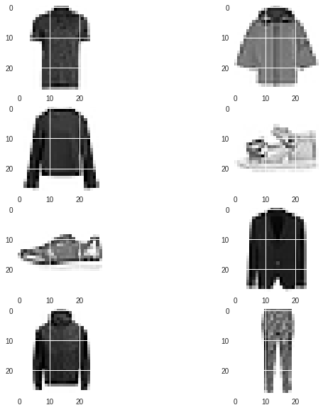
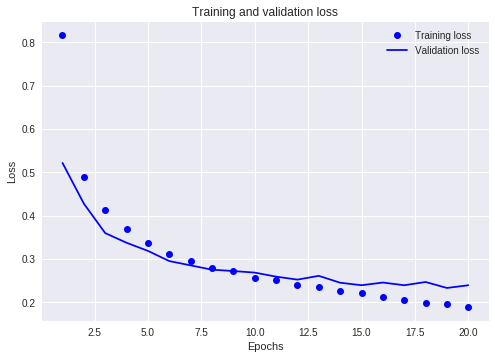
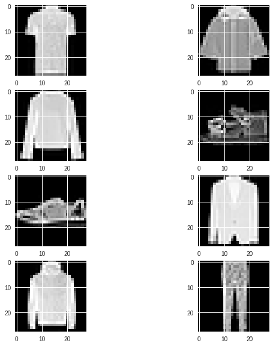
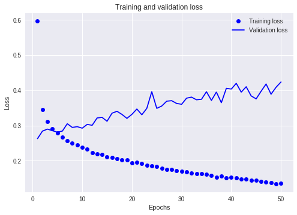
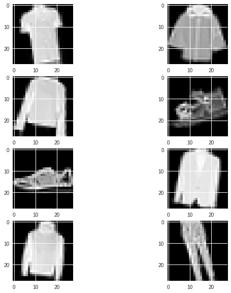
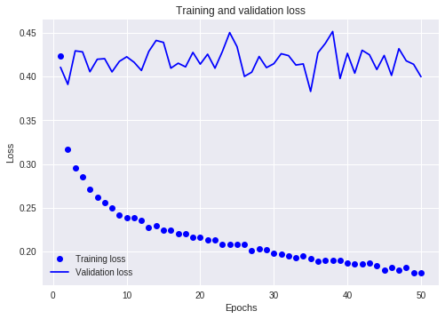
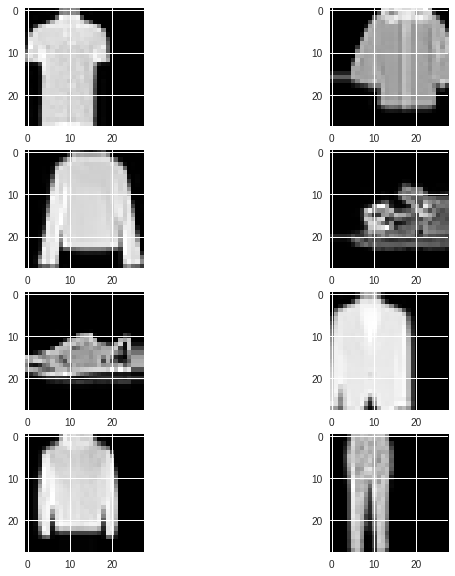
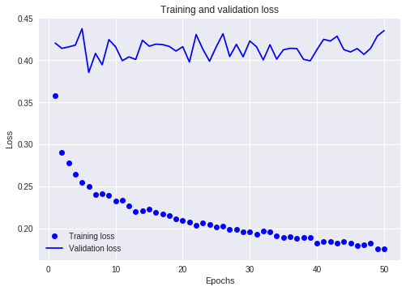
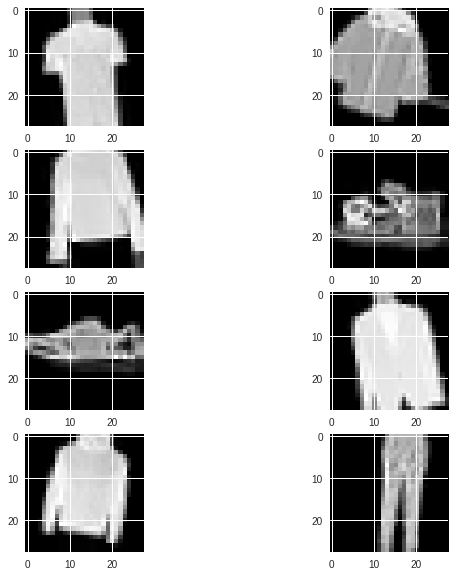
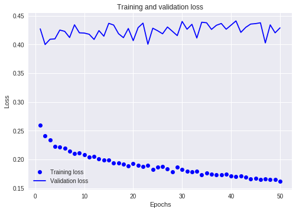

# We will see how Multi label classification is done using Convolutional Neural Network

We will be using Fashion Data Set for this particular Exercise which is available in Keras library. It has about 70000 records, Let us use 48000 for training,12000 for validation and 10000 for test set.

**We have 10 classes in the output**.
Label Description 
 - 0 T-shirt/top 
 - 1 Trouser 
 - 2 Pullover 
 - 3 Dress 
 - 4 Coat 
 - 5 Sandal 
 - 6 Shirt 
 - 7 Sneaker 
 - 8 Bag 
 - 9 Ankle boot

# **Obtaining the data from keras**


```python
import tensorflow as tf
import numpy as np
import matplotlib.pyplot as plt
# Load the fashion-mnist pre-shuffled train data and test data
(x_train, y_train), (x_test, y_test) = tf.keras.datasets.fashion_mnist.load_data()
print("x_train shape:", x_train.shape, "y_train shape:", y_train.shape)
print("x_test shape:", x_test.shape, "y_test shape:", y_test.shape)
```

    x_train shape: (60000, 28, 28) y_train shape: (60000,)
    x_test shape: (10000, 28, 28) y_test shape: (10000,)
    

**We have 60k records for training and around 10k records for the test data. Let us divide the training into 80:20 as training and validation data.**


```python
from sklearn.model_selection import train_test_split
x_train_1,x_valid, y_train_1, y_valid = train_test_split(x_train, y_train, test_size=0.2, random_state=123)
```

**xtrain_1 refers to the training data that is the 80% of the original training data and x_valid refers to the validation data set**


```python
#Let us see how couple of images look in the training set and what the size of the image is
fig, ax = plt.subplots(nrows=4, ncols=2,figsize=(10,10))
for i in range(0,8):
  plt.subplot(4,2,i+1)
  plt.imshow(x_train_1[i])

  
print("Number of training examples: ",x_train_1.shape[0])
print("Size of the image: ",x_train_1.shape[1], "X",x_train_1.shape[2])

```

    Number of training examples:  48000
    Size of the image:  28 X 28
    





 **We have diferent objects like shoes, sandals, coat,jacket and tee shirt, we get to know how the image looks like from this sample and its size as 28x28**

# **Let us create a Convolutional Neural Networ as follows:**
## Input Layer(28*28 image size)
## Convolutional layer  (64 maps, 5*5)
## Maxpooling layer (2*2)
## Dropout Layer (30%)
## Convolutional layer  (32 maps, 5*5)
## Maxpooling layer (2*2)
## Dropout Layer (30%)
## Flatten Layer
## Hidden layer(128 Neurons)
## Hidden layer(64 Neurons)
## Output Layer(10 outputs)


```python
# Simple CNN for the MNIST Dataset
import numpy
from keras.datasets import mnist
from keras.models import Sequential
from keras.layers import Dense
from keras.layers import Dropout
from keras.layers import Flatten
from keras.layers.convolutional import Convolution2D
from keras.layers.convolutional import MaxPooling2D
from keras.utils import np_utils
from keras import backend as K
K.set_image_dim_ordering('th')
# fix random seed for reproducibility
seed = 7
numpy.random.seed(seed)
# reshape to be [samples][channels][width][height]
x_train_1 = x_train_1.reshape(x_train_1.shape[0], 1, 28, 28).astype( 'float32' )
x_valid = x_valid.reshape(x_valid.shape[0], 1, 28, 28).astype( 'float32' )
x_test = x_test.reshape(x_test.shape[0], 1, 28, 28).astype( 'float32' )

# normalize inputs from 0-255 to 0-1
x_train_1 = x_train_1 / 255
x_test = x_test / 255
x_valid = x_valid  /255
# one hot encode outputs
y_train_1 = np_utils.to_categorical(y_train_1)
y_valid = np_utils.to_categorical(y_valid)
y_test = np_utils.to_categorical(y_test)
num_classes = y_test.shape[1]
print("Number of classes in the output :", num_classes)

# create model
def baseline_model():

  model = Sequential()
  model.add(Convolution2D(64, 5, 5, input_shape=(1, 28, 28), activation= 'relu'))
  model.add(MaxPooling2D(pool_size=(2, 2)))
  model.add(Dropout(0.2))
  model.add(Convolution2D(64, 5, 5, activation= 'relu' ))
  model.add(MaxPooling2D(pool_size=(2, 2)))
  model.add(Dropout(0.2))
  model.add(Flatten())
  model.add(Dense(128, activation= 'relu' ))
  model.add(Dense(64, activation= 'relu' ))
  model.add(Dense(num_classes, activation= 'softmax'))
  # Compile model
  model.compile(loss= 'categorical_crossentropy' , optimizer= 'adam' , metrics=[ 'accuracy' ])
  return model

# build the model
model = baseline_model()
# Fit the model
history = model.fit(x_train_1, y_train_1, validation_data=(x_valid, y_valid), epochs=20, batch_size=400,verbose=2)

```

    Number of classes in the output : 10
    

    /usr/local/lib/python3.6/dist-packages/ipykernel_launcher.py:35: UserWarning: Update your `Conv2D` call to the Keras 2 API: `Conv2D(64, (5, 5), input_shape=(1, 28, 28..., activation="relu")`
    /usr/local/lib/python3.6/dist-packages/ipykernel_launcher.py:38: UserWarning: Update your `Conv2D` call to the Keras 2 API: `Conv2D(64, (5, 5), activation="relu")`
    

    Train on 48000 samples, validate on 12000 samples
    Epoch 1/20
     - 4s - loss: 0.8156 - acc: 0.6998 - val_loss: 0.5214 - val_acc: 0.8151
    Epoch 2/20
     - 3s - loss: 0.4890 - acc: 0.8206 - val_loss: 0.4275 - val_acc: 0.8466
    Epoch 3/20
     - 3s - loss: 0.4119 - acc: 0.8505 - val_loss: 0.3595 - val_acc: 0.8732
    Epoch 4/20
     - 3s - loss: 0.3679 - acc: 0.8667 - val_loss: 0.3372 - val_acc: 0.8810
    Epoch 5/20
     - 3s - loss: 0.3363 - acc: 0.8772 - val_loss: 0.3185 - val_acc: 0.8851
    Epoch 6/20
     - 3s - loss: 0.3118 - acc: 0.8841 - val_loss: 0.2950 - val_acc: 0.8928
    Epoch 7/20
     - 3s - loss: 0.2940 - acc: 0.8915 - val_loss: 0.2850 - val_acc: 0.8964
    Epoch 8/20
     - 3s - loss: 0.2787 - acc: 0.8978 - val_loss: 0.2750 - val_acc: 0.9024
    Epoch 9/20
     - 3s - loss: 0.2720 - acc: 0.8990 - val_loss: 0.2720 - val_acc: 0.9010
    Epoch 10/20
     - 3s - loss: 0.2568 - acc: 0.9051 - val_loss: 0.2684 - val_acc: 0.9022
    Epoch 11/20
     - 3s - loss: 0.2507 - acc: 0.9073 - val_loss: 0.2590 - val_acc: 0.9066
    Epoch 12/20
     - 3s - loss: 0.2405 - acc: 0.9103 - val_loss: 0.2522 - val_acc: 0.9101
    Epoch 13/20
     - 3s - loss: 0.2347 - acc: 0.9117 - val_loss: 0.2609 - val_acc: 0.9071
    Epoch 14/20
     - 3s - loss: 0.2253 - acc: 0.9167 - val_loss: 0.2450 - val_acc: 0.9138
    Epoch 15/20
     - 3s - loss: 0.2205 - acc: 0.9173 - val_loss: 0.2393 - val_acc: 0.9148
    Epoch 16/20
     - 3s - loss: 0.2117 - acc: 0.9208 - val_loss: 0.2454 - val_acc: 0.9128
    Epoch 17/20
     - 3s - loss: 0.2046 - acc: 0.9229 - val_loss: 0.2392 - val_acc: 0.9165
    Epoch 18/20
     - 3s - loss: 0.1986 - acc: 0.9249 - val_loss: 0.2467 - val_acc: 0.9134
    Epoch 19/20
     - 3s - loss: 0.1949 - acc: 0.9264 - val_loss: 0.2329 - val_acc: 0.9180
    Epoch 20/20
     - 3s - loss: 0.1885 - acc: 0.9291 - val_loss: 0.2392 - val_acc: 0.9179
    


```python
# Lets plot the graph of Training loss vs Validation Loss
import matplotlib.pyplot as plt

loss = history.history['loss']
val_loss = history.history['val_loss']

epochs = range(1, len(loss) + 1)

plt.plot(epochs, loss, 'bo', label='Training loss')
plt.plot(epochs, val_loss, 'b', label='Validation loss')
plt.title('Training and validation loss')
plt.xlabel('Epochs')
plt.ylabel('Loss')
plt.legend()

plt.show() 

epoch_optimum= np.argmin(val_loss) 

print("Optimum epoch:= ", epoch_optimum)
```





    Optimum epoch:=  18
    


```python

#We got to know that the validation loss is minimum at epoch=5, lets fit a new model and evaluate
model.fit(x_train_1, y_train_1, epochs=epoch_optimum, batch_size=400)

# Final evaluation of the model
scores = model.evaluate(x_test, y_test, verbose=0)
print("CNN Error: %.2f%%" % (100-scores[1]*100))
```

    Epoch 1/18
    48000/48000 [==============================] - 3s 68us/step - loss: 0.1865 - acc: 0.9292
    Epoch 2/18
    48000/48000 [==============================] - 3s 70us/step - loss: 0.1775 - acc: 0.9328
    Epoch 3/18
    48000/48000 [==============================] - 3s 69us/step - loss: 0.1773 - acc: 0.9327
    Epoch 4/18
    48000/48000 [==============================] - 3s 70us/step - loss: 0.1740 - acc: 0.9347
    Epoch 5/18
    48000/48000 [==============================] - 3s 70us/step - loss: 0.1692 - acc: 0.9365
    Epoch 6/18
    48000/48000 [==============================] - 3s 69us/step - loss: 0.1633 - acc: 0.9376
    Epoch 7/18
    48000/48000 [==============================] - 3s 71us/step - loss: 0.1557 - acc: 0.9415
    Epoch 8/18
    48000/48000 [==============================] - 3s 69us/step - loss: 0.1531 - acc: 0.9421
    Epoch 9/18
    48000/48000 [==============================] - 3s 70us/step - loss: 0.1475 - acc: 0.9443
    Epoch 10/18
    48000/48000 [==============================] - 3s 70us/step - loss: 0.1443 - acc: 0.9462
    Epoch 11/18
    48000/48000 [==============================] - 3s 71us/step - loss: 0.1425 - acc: 0.9461
    Epoch 12/18
    48000/48000 [==============================] - 3s 68us/step - loss: 0.1353 - acc: 0.9484
    Epoch 13/18
    48000/48000 [==============================] - 3s 70us/step - loss: 0.1346 - acc: 0.9491
    Epoch 14/18
    48000/48000 [==============================] - 3s 70us/step - loss: 0.1308 - acc: 0.9504
    Epoch 15/18
    48000/48000 [==============================] - 3s 70us/step - loss: 0.1306 - acc: 0.9506
    Epoch 16/18
    48000/48000 [==============================] - 3s 70us/step - loss: 0.1270 - acc: 0.9516
    Epoch 17/18
    48000/48000 [==============================] - 3s 68us/step - loss: 0.1219 - acc: 0.9535
    Epoch 18/18
    48000/48000 [==============================] - 3s 70us/step - loss: 0.1202 - acc: 0.9543
    CNN Error: 8.07%
    

 **we are getting an error of about 8.07% , Let us try to improve this by using Data Processing techniques**


```python

# mount your Drive
import keras
from google.colab import drive, files

drive.mount('/content/drive/')


filepath="/content/drive/My Drive/datasets/myweights-improvement-{epoch:02d}-{loss:.4f}.hdf5"

checkpoint = keras.callbacks.ModelCheckpoint(filepath, monitor='loss', verbose=1, save_best_only=True,mode='min')


callbacks_list = [checkpoint]
```

    Drive already mounted at /content/drive/; to attempt to forcibly remount, call drive.mount("/content/drive/", force_remount=True).
    

# **Data Augmentation**

### Overfitting is caused by having too few samples to learn from, rendering you unable to train a model that can generalize to new data. Given infinite data, your model would be exposed to every possible aspect of the data distribution at hand: you would never overfit. Data augmentation takes the approach of generating more training data from existing training samples, by augmenting the samples via a number of random transformations that yield believable-looking images. The goal is that at training time, your model will never see the exact same picture twice. This helps expose the model to more aspects of the data and generalize better

# **1. Feature Standardization:**standardize pixel values across the entire dataset


```python
from keras.preprocessing.image import ImageDataGenerator
from keras.utils import np_utils
from keras import backend as K
K.set_image_dim_ordering('th')

datagen = ImageDataGenerator(featurewise_center=True,featurewise_std_normalization=True)

datagen.fit(x_train_1)

augmented_data_X = []
augmented_data_y = []

num_augmented = 0
batch_size = 128
for X_batch, y_batch in datagen.flow(x_train_1, y_train_1, batch_size = batch_size, shuffle=False):
    augmented_data_X.append(X_batch)
    augmented_data_y.append(y_batch)
    num_augmented += batch_size
    if num_augmented == x_train_1.shape[0]:
        break
augmented_data_X = np.concatenate(augmented_data_X)
augmented_data_y = np.concatenate(augmented_data_y)

```


```python
# reshape to be [samples][channels][width][height]
augmented_data_X = augmented_data_X.reshape(augmented_data_X.shape[0], 1, 28, 28).astype( 'float32' )

# normalize inputs from 0-255 to 0-1
augmented_data_X  = augmented_data_X  / 255

#Let us see how couple of images look in the augmented data set
fig, ax = plt.subplots(nrows=4, ncols=2,figsize=(10,10))
for i in range(0,8):
  plt.subplot(4,2,i+1)
  plt.imshow(augmented_data_X[i].reshape(28, 28), cmap=plt.get_cmap( 'gray' ))


```





**We see that the images and the patterns are much better than before**


```python
#Let us append the augmented image with the original xtrain and we get a total of 96000 training images now in total,12000 images for validation and 10000 images for testing
X_new = np.concatenate((x_train_1,augmented_data_X))
Y_new = np.concatenate((y_train_1,augmented_data_y))


history =  model.fit(X_new, Y_new, validation_data=(x_valid, y_valid), epochs=50, batch_size=400,verbose=2)

```

    Train on 96000 samples, validate on 12000 samples
    Epoch 1/50
     - 6s - loss: 0.5964 - acc: 0.7869 - val_loss: 0.2627 - val_acc: 0.9173
    Epoch 2/50
     - 6s - loss: 0.3460 - acc: 0.8699 - val_loss: 0.2840 - val_acc: 0.9185
    Epoch 3/50
     - 6s - loss: 0.3113 - acc: 0.8836 - val_loss: 0.2898 - val_acc: 0.9080
    Epoch 4/50
     - 6s - loss: 0.2915 - acc: 0.8906 - val_loss: 0.2853 - val_acc: 0.9166
    Epoch 5/50
     - 6s - loss: 0.2788 - acc: 0.8954 - val_loss: 0.2811 - val_acc: 0.9133
    Epoch 6/50
     - 6s - loss: 0.2668 - acc: 0.9005 - val_loss: 0.2841 - val_acc: 0.9172
    Epoch 7/50
     - 6s - loss: 0.2565 - acc: 0.9046 - val_loss: 0.3051 - val_acc: 0.9122
    Epoch 8/50
     - 6s - loss: 0.2494 - acc: 0.9071 - val_loss: 0.2945 - val_acc: 0.9180
    Epoch 9/50
     - 6s - loss: 0.2441 - acc: 0.9073 - val_loss: 0.2967 - val_acc: 0.9154
    Epoch 10/50
     - 6s - loss: 0.2376 - acc: 0.9113 - val_loss: 0.2924 - val_acc: 0.9142
    Epoch 11/50
     - 6s - loss: 0.2333 - acc: 0.9133 - val_loss: 0.3031 - val_acc: 0.9138
    Epoch 12/50
     - 6s - loss: 0.2233 - acc: 0.9167 - val_loss: 0.3006 - val_acc: 0.9162
    Epoch 13/50
     - 6s - loss: 0.2192 - acc: 0.9174 - val_loss: 0.3215 - val_acc: 0.9178
    Epoch 14/50
     - 6s - loss: 0.2171 - acc: 0.9186 - val_loss: 0.3231 - val_acc: 0.9182
    Epoch 15/50
     - 6s - loss: 0.2110 - acc: 0.9218 - val_loss: 0.3121 - val_acc: 0.9193
    Epoch 16/50
     - 6s - loss: 0.2095 - acc: 0.9218 - val_loss: 0.3350 - val_acc: 0.9181
    Epoch 17/50
     - 6s - loss: 0.2054 - acc: 0.9235 - val_loss: 0.3403 - val_acc: 0.9143
    Epoch 18/50
     - 6s - loss: 0.2023 - acc: 0.9241 - val_loss: 0.3315 - val_acc: 0.9177
    Epoch 19/50
     - 6s - loss: 0.2016 - acc: 0.9247 - val_loss: 0.3203 - val_acc: 0.9171
    Epoch 20/50
     - 6s - loss: 0.1933 - acc: 0.9282 - val_loss: 0.3317 - val_acc: 0.9172
    Epoch 21/50
     - 6s - loss: 0.1949 - acc: 0.9274 - val_loss: 0.3468 - val_acc: 0.9149
    Epoch 22/50
     - 6s - loss: 0.1915 - acc: 0.9283 - val_loss: 0.3305 - val_acc: 0.9168
    Epoch 23/50
     - 6s - loss: 0.1864 - acc: 0.9301 - val_loss: 0.3488 - val_acc: 0.9172
    Epoch 24/50
     - 6s - loss: 0.1852 - acc: 0.9309 - val_loss: 0.3961 - val_acc: 0.9158
    Epoch 25/50
     - 6s - loss: 0.1832 - acc: 0.9315 - val_loss: 0.3487 - val_acc: 0.9192
    Epoch 26/50
     - 6s - loss: 0.1788 - acc: 0.9329 - val_loss: 0.3554 - val_acc: 0.9203
    Epoch 27/50
     - 6s - loss: 0.1758 - acc: 0.9343 - val_loss: 0.3691 - val_acc: 0.9146
    Epoch 28/50
     - 6s - loss: 0.1743 - acc: 0.9348 - val_loss: 0.3705 - val_acc: 0.9163
    Epoch 29/50
     - 6s - loss: 0.1717 - acc: 0.9355 - val_loss: 0.3627 - val_acc: 0.9198
    Epoch 30/50
     - 6s - loss: 0.1700 - acc: 0.9363 - val_loss: 0.3603 - val_acc: 0.9166
    Epoch 31/50
     - 6s - loss: 0.1682 - acc: 0.9368 - val_loss: 0.3777 - val_acc: 0.9156
    Epoch 32/50
     - 6s - loss: 0.1646 - acc: 0.9390 - val_loss: 0.3806 - val_acc: 0.9153
    Epoch 33/50
     - 6s - loss: 0.1632 - acc: 0.9390 - val_loss: 0.3731 - val_acc: 0.9166
    Epoch 34/50
     - 6s - loss: 0.1635 - acc: 0.9388 - val_loss: 0.3744 - val_acc: 0.9173
    Epoch 35/50
     - 6s - loss: 0.1610 - acc: 0.9404 - val_loss: 0.3960 - val_acc: 0.9188
    Epoch 36/50
     - 6s - loss: 0.1577 - acc: 0.9420 - val_loss: 0.3713 - val_acc: 0.9172
    Epoch 37/50
     - 6s - loss: 0.1537 - acc: 0.9424 - val_loss: 0.3950 - val_acc: 0.9178
    Epoch 38/50
     - 6s - loss: 0.1568 - acc: 0.9418 - val_loss: 0.3648 - val_acc: 0.9159
    Epoch 39/50
     - 6s - loss: 0.1516 - acc: 0.9438 - val_loss: 0.4054 - val_acc: 0.9148
    Epoch 40/50
     - 6s - loss: 0.1529 - acc: 0.9423 - val_loss: 0.4036 - val_acc: 0.9181
    Epoch 41/50
     - 6s - loss: 0.1512 - acc: 0.9442 - val_loss: 0.4198 - val_acc: 0.9161
    Epoch 42/50
     - 6s - loss: 0.1469 - acc: 0.9445 - val_loss: 0.3948 - val_acc: 0.9197
    Epoch 43/50
     - 6s - loss: 0.1474 - acc: 0.9455 - val_loss: 0.4101 - val_acc: 0.9148
    Epoch 44/50
     - 6s - loss: 0.1446 - acc: 0.9453 - val_loss: 0.3841 - val_acc: 0.9171
    Epoch 45/50
     - 6s - loss: 0.1442 - acc: 0.9460 - val_loss: 0.3757 - val_acc: 0.9151
    Epoch 46/50
     - 6s - loss: 0.1415 - acc: 0.9477 - val_loss: 0.3974 - val_acc: 0.9173
    Epoch 47/50
     - 6s - loss: 0.1393 - acc: 0.9482 - val_loss: 0.4179 - val_acc: 0.9195
    Epoch 48/50
     - 6s - loss: 0.1380 - acc: 0.9484 - val_loss: 0.3890 - val_acc: 0.9192
    Epoch 49/50
     - 6s - loss: 0.1338 - acc: 0.9511 - val_loss: 0.4085 - val_acc: 0.9179
    Epoch 50/50
     - 6s - loss: 0.1361 - acc: 0.9482 - val_loss: 0.4236 - val_acc: 0.9186
    


```python
# Lets plot the graph of Training loss vs Validation Loss
import matplotlib.pyplot as plt

loss = history.history['loss']
val_loss = history.history['val_loss']

epochs = range(1, len(loss) + 1)

plt.plot(epochs, loss, 'bo', label='Training loss')
plt.plot(epochs, val_loss, 'b', label='Validation loss')
plt.title('Training and validation loss')
plt.xlabel('Epochs')
plt.ylabel('Loss')
plt.legend()

plt.show() 

epoch_optimum= np.argmin(val_loss) 

print("Optimum epoch:= ", epoch_optimum)
```





    Optimum epoch:=  0
    


```python

#We got to know that the validation loss is minimum at epoch=5, lets fit a new model and evaluate
model.fit(X_new, Y_new, epochs= epoch_optimum, batch_size=400)

# Final evaluation of the model
scores_2 = model.evaluate(x_test, y_test, verbose=0)
print("CNN Error: %.2f%%" % (100-scores_2[1]*100))
```

    CNN Error: 8.43%
    

**We see that the model is performing more or less the same way, with error close to the model without augmented images**


```python

# mount your Drive
import keras
from google.colab import drive, files

drive.mount('/content/drive/')


filepath="/content/drive/My Drive/datasets_1/myweights-improvement-{epoch:02d}-{loss:.4f}.hdf5"

checkpoint_1 = keras.callbacks.ModelCheckpoint(filepath, monitor='loss', verbose=1, save_best_only=True,mode='min')


callbacks_list = [checkpoint_1]
```

    Drive already mounted at /content/drive/; to attempt to forcibly remount, call drive.mount("/content/drive/", force_remount=True).
    

# **2. Random Rotation + Standardisation**


```python

datagen = ImageDataGenerator(featurewise_center=True,featurewise_std_normalization=True,rotation_range = 20)


augmented_data_X_part2 = []
augmented_data_y_part2 = []

num_augmented = 0
batch_size = 128
for X_batch, y_batch in datagen.flow(x_train_1, y_train_1, batch_size = batch_size, shuffle=False):
    augmented_data_X_part2.append(X_batch)
    augmented_data_y_part2.append(y_batch)
    num_augmented += batch_size
    if num_augmented == x_train_1.shape[0]:
        break
augmented_data_X_part2 = np.concatenate(augmented_data_X_part2)
augmented_data_y_part2 = np.concatenate(augmented_data_y_part2)
```

    /usr/local/lib/python3.6/dist-packages/keras_preprocessing/image/image_data_generator.py:699: UserWarning: This ImageDataGenerator specifies `featurewise_center`, but it hasn't been fit on any training data. Fit it first by calling `.fit(numpy_data)`.
      warnings.warn('This ImageDataGenerator specifies '
    /usr/local/lib/python3.6/dist-packages/keras_preprocessing/image/image_data_generator.py:707: UserWarning: This ImageDataGenerator specifies `featurewise_std_normalization`, but it hasn't been fit on any training data. Fit it first by calling `.fit(numpy_data)`.
      warnings.warn('This ImageDataGenerator specifies '
    


```python
#LEt us see how the sample looks like

# reshape to be [samples][channels][width][height]
augmented_data_X_part2 = augmented_data_X_part2.reshape(augmented_data_X_part2.shape[0], 1, 28, 28).astype( 'float32' )

# normalize inputs from 0-255 to 0-1
augmented_data_X_part2  = augmented_data_X_part2  / 255

#Let us see how couple of images look in the augmented data set
fig, ax = plt.subplots(nrows=4, ncols=2,figsize=(10,10))
for i in range(0,8):
  plt.subplot(4,2,i+1)
  plt.imshow(augmented_data_X_part2[i].reshape(28, 28), cmap=plt.get_cmap( 'gray' ))


```





```python


X_new_part2 = np.concatenate((x_train_1,augmented_data_X_part2))
Y_new_part2 = np.concatenate((y_train_1,augmented_data_y_part2))

history = model.fit(X_new_part2, Y_new_part2, validation_data=(x_valid, y_valid), epochs=50, batch_size=400,verbose=2)

```

    Train on 96000 samples, validate on 12000 samples
    Epoch 1/50
     - 6s - loss: 0.4229 - acc: 0.8451 - val_loss: 0.4104 - val_acc: 0.9145
    Epoch 2/50
     - 6s - loss: 0.3168 - acc: 0.8821 - val_loss: 0.3909 - val_acc: 0.9143
    Epoch 3/50
     - 6s - loss: 0.2951 - acc: 0.8889 - val_loss: 0.4293 - val_acc: 0.9130
    Epoch 4/50
     - 6s - loss: 0.2853 - acc: 0.8929 - val_loss: 0.4280 - val_acc: 0.9132
    Epoch 5/50
     - 6s - loss: 0.2713 - acc: 0.8974 - val_loss: 0.4053 - val_acc: 0.9185
    Epoch 6/50
     - 6s - loss: 0.2621 - acc: 0.9023 - val_loss: 0.4196 - val_acc: 0.9148
    Epoch 7/50
     - 6s - loss: 0.2560 - acc: 0.9042 - val_loss: 0.4203 - val_acc: 0.9133
    Epoch 8/50
     - 6s - loss: 0.2493 - acc: 0.9068 - val_loss: 0.4052 - val_acc: 0.9194
    Epoch 9/50
     - 6s - loss: 0.2421 - acc: 0.9095 - val_loss: 0.4172 - val_acc: 0.9205
    Epoch 10/50
     - 6s - loss: 0.2390 - acc: 0.9103 - val_loss: 0.4225 - val_acc: 0.9172
    Epoch 11/50
     - 6s - loss: 0.2381 - acc: 0.9112 - val_loss: 0.4162 - val_acc: 0.9178
    Epoch 12/50
     - 6s - loss: 0.2352 - acc: 0.9128 - val_loss: 0.4068 - val_acc: 0.9178
    Epoch 13/50
     - 6s - loss: 0.2279 - acc: 0.9145 - val_loss: 0.4285 - val_acc: 0.9177
    Epoch 14/50
     - 6s - loss: 0.2293 - acc: 0.9144 - val_loss: 0.4411 - val_acc: 0.9165
    Epoch 15/50
     - 6s - loss: 0.2247 - acc: 0.9156 - val_loss: 0.4389 - val_acc: 0.9121
    Epoch 16/50
     - 6s - loss: 0.2242 - acc: 0.9172 - val_loss: 0.4095 - val_acc: 0.9200
    Epoch 17/50
     - 6s - loss: 0.2204 - acc: 0.9173 - val_loss: 0.4151 - val_acc: 0.9191
    Epoch 18/50
     - 6s - loss: 0.2208 - acc: 0.9182 - val_loss: 0.4109 - val_acc: 0.9183
    Epoch 19/50
     - 6s - loss: 0.2158 - acc: 0.9193 - val_loss: 0.4275 - val_acc: 0.9188
    Epoch 20/50
     - 6s - loss: 0.2161 - acc: 0.9198 - val_loss: 0.4140 - val_acc: 0.9173
    Epoch 21/50
     - 6s - loss: 0.2135 - acc: 0.9203 - val_loss: 0.4254 - val_acc: 0.9180
    Epoch 22/50
     - 6s - loss: 0.2127 - acc: 0.9195 - val_loss: 0.4094 - val_acc: 0.9168
    Epoch 23/50
     - 6s - loss: 0.2084 - acc: 0.9219 - val_loss: 0.4284 - val_acc: 0.9197
    Epoch 24/50
     - 6s - loss: 0.2077 - acc: 0.9221 - val_loss: 0.4501 - val_acc: 0.9148
    Epoch 25/50
     - 6s - loss: 0.2085 - acc: 0.9225 - val_loss: 0.4340 - val_acc: 0.9169
    Epoch 26/50
     - 6s - loss: 0.2077 - acc: 0.9226 - val_loss: 0.4000 - val_acc: 0.9197
    Epoch 27/50
     - 6s - loss: 0.2011 - acc: 0.9250 - val_loss: 0.4049 - val_acc: 0.9226
    Epoch 28/50
     - 6s - loss: 0.2034 - acc: 0.9245 - val_loss: 0.4228 - val_acc: 0.9167
    Epoch 29/50
     - 6s - loss: 0.2019 - acc: 0.9244 - val_loss: 0.4101 - val_acc: 0.9198
    Epoch 30/50
     - 6s - loss: 0.1977 - acc: 0.9257 - val_loss: 0.4146 - val_acc: 0.9198
    Epoch 31/50
     - 6s - loss: 0.1973 - acc: 0.9260 - val_loss: 0.4260 - val_acc: 0.9213
    Epoch 32/50
     - 6s - loss: 0.1948 - acc: 0.9273 - val_loss: 0.4238 - val_acc: 0.9190
    Epoch 33/50
     - 6s - loss: 0.1931 - acc: 0.9280 - val_loss: 0.4130 - val_acc: 0.9201
    Epoch 34/50
     - 6s - loss: 0.1952 - acc: 0.9274 - val_loss: 0.4143 - val_acc: 0.9208
    Epoch 35/50
     - 6s - loss: 0.1917 - acc: 0.9276 - val_loss: 0.3828 - val_acc: 0.9201
    Epoch 36/50
     - 6s - loss: 0.1885 - acc: 0.9293 - val_loss: 0.4271 - val_acc: 0.9181
    Epoch 37/50
     - 6s - loss: 0.1897 - acc: 0.9285 - val_loss: 0.4378 - val_acc: 0.9217
    Epoch 38/50
     - 6s - loss: 0.1895 - acc: 0.9287 - val_loss: 0.4514 - val_acc: 0.9172
    Epoch 39/50
     - 6s - loss: 0.1894 - acc: 0.9292 - val_loss: 0.3976 - val_acc: 0.9190
    Epoch 40/50
     - 6s - loss: 0.1869 - acc: 0.9308 - val_loss: 0.4264 - val_acc: 0.9186
    Epoch 41/50
     - 6s - loss: 0.1859 - acc: 0.9297 - val_loss: 0.4038 - val_acc: 0.9208
    Epoch 42/50
     - 6s - loss: 0.1860 - acc: 0.9313 - val_loss: 0.4299 - val_acc: 0.9196
    Epoch 43/50
     - 6s - loss: 0.1869 - acc: 0.9296 - val_loss: 0.4248 - val_acc: 0.9194
    Epoch 44/50
     - 6s - loss: 0.1838 - acc: 0.9309 - val_loss: 0.4079 - val_acc: 0.9172
    Epoch 45/50
     - 6s - loss: 0.1786 - acc: 0.9325 - val_loss: 0.4240 - val_acc: 0.9198
    Epoch 46/50
     - 6s - loss: 0.1822 - acc: 0.9316 - val_loss: 0.4012 - val_acc: 0.9204
    Epoch 47/50
     - 6s - loss: 0.1787 - acc: 0.9333 - val_loss: 0.4317 - val_acc: 0.9191
    Epoch 48/50
     - 6s - loss: 0.1816 - acc: 0.9319 - val_loss: 0.4178 - val_acc: 0.9222
    Epoch 49/50
     - 6s - loss: 0.1759 - acc: 0.9341 - val_loss: 0.4139 - val_acc: 0.9201
    Epoch 50/50
     - 6s - loss: 0.1754 - acc: 0.9341 - val_loss: 0.3997 - val_acc: 0.9194
    


```python
# Lets plot the graph of Training loss vs Validation Loss
import matplotlib.pyplot as plt

loss = history.history['loss']
val_loss = history.history['val_loss']

epochs = range(1, len(loss) + 1)

plt.plot(epochs, loss, 'bo', label='Training loss')
plt.plot(epochs, val_loss, 'b', label='Validation loss')
plt.title('Training and validation loss')
plt.xlabel('Epochs')
plt.ylabel('Loss')
plt.legend()

plt.show() 

epoch_optimum= np.argmin(val_loss) 

print("Optimum epoch:= ", epoch_optimum)
```





    Optimum epoch:=  34
    


```python
#We got to know that the validation loss is minimum at epoch=5, lets fit a new model and evaluate
model.fit(X_new_part2, Y_new_part2, epochs=epoch_optimum , batch_size=400)

# Final evaluation of the model
scores_part2 = model.evaluate(x_test, y_test, verbose=0)
print("CNN Error: %.2f%%" % (100-scores_part2[1]*100))
```

    Epoch 1/34
    96000/96000 [==============================] - 7s 69us/step - loss: 0.1725 - acc: 0.9345
    Epoch 2/34
    96000/96000 [==============================] - 7s 69us/step - loss: 0.1696 - acc: 0.9364
    Epoch 3/34
    96000/96000 [==============================] - 7s 69us/step - loss: 0.1757 - acc: 0.9339
    Epoch 4/34
    96000/96000 [==============================] - 7s 68us/step - loss: 0.1741 - acc: 0.9352
    Epoch 5/34
    96000/96000 [==============================] - 7s 69us/step - loss: 0.1696 - acc: 0.9361
    Epoch 6/34
    96000/96000 [==============================] - 7s 69us/step - loss: 0.1679 - acc: 0.9372
    Epoch 7/34
    96000/96000 [==============================] - 7s 69us/step - loss: 0.1703 - acc: 0.9358
    Epoch 8/34
    96000/96000 [==============================] - 7s 69us/step - loss: 0.1683 - acc: 0.9368
    Epoch 9/34
    96000/96000 [==============================] - 7s 68us/step - loss: 0.1700 - acc: 0.9356
    Epoch 10/34
    96000/96000 [==============================] - 6s 67us/step - loss: 0.1687 - acc: 0.9371
    Epoch 11/34
    96000/96000 [==============================] - 6s 67us/step - loss: 0.1647 - acc: 0.9382
    Epoch 12/34
    96000/96000 [==============================] - 6s 67us/step - loss: 0.1663 - acc: 0.9376
    Epoch 13/34
    96000/96000 [==============================] - 6s 67us/step - loss: 0.1658 - acc: 0.9382
    Epoch 14/34
    96000/96000 [==============================] - 6s 67us/step - loss: 0.1659 - acc: 0.9371
    Epoch 15/34
    96000/96000 [==============================] - 6s 67us/step - loss: 0.1635 - acc: 0.9389
    Epoch 16/34
    96000/96000 [==============================] - 6s 67us/step - loss: 0.1624 - acc: 0.9393
    Epoch 17/34
    96000/96000 [==============================] - 6s 67us/step - loss: 0.1626 - acc: 0.9386
    Epoch 18/34
    96000/96000 [==============================] - 6s 67us/step - loss: 0.1605 - acc: 0.9400
    Epoch 19/34
    96000/96000 [==============================] - 6s 67us/step - loss: 0.1682 - acc: 0.9368
    Epoch 20/34
    96000/96000 [==============================] - 6s 67us/step - loss: 0.1562 - acc: 0.9411
    Epoch 21/34
    96000/96000 [==============================] - 7s 70us/step - loss: 0.1609 - acc: 0.9392
    Epoch 22/34
    96000/96000 [==============================] - 7s 71us/step - loss: 0.1598 - acc: 0.9403
    Epoch 23/34
    96000/96000 [==============================] - 7s 71us/step - loss: 0.1583 - acc: 0.9409
    Epoch 24/34
    96000/96000 [==============================] - 7s 71us/step - loss: 0.1594 - acc: 0.9402
    Epoch 25/34
    96000/96000 [==============================] - 7s 71us/step - loss: 0.1575 - acc: 0.9399
    Epoch 26/34
    96000/96000 [==============================] - 7s 70us/step - loss: 0.1566 - acc: 0.9404
    Epoch 27/34
    96000/96000 [==============================] - 7s 70us/step - loss: 0.1561 - acc: 0.9417
    Epoch 28/34
    96000/96000 [==============================] - 7s 70us/step - loss: 0.1544 - acc: 0.9424
    Epoch 29/34
    96000/96000 [==============================] - 7s 70us/step - loss: 0.1577 - acc: 0.9415
    Epoch 30/34
    96000/96000 [==============================] - 7s 70us/step - loss: 0.1543 - acc: 0.9417
    Epoch 31/34
    96000/96000 [==============================] - 7s 70us/step - loss: 0.1512 - acc: 0.9431
    Epoch 32/34
    96000/96000 [==============================] - 7s 71us/step - loss: 0.1549 - acc: 0.9417
    Epoch 33/34
    96000/96000 [==============================] - 7s 71us/step - loss: 0.1515 - acc: 0.9426
    Epoch 34/34
    96000/96000 [==============================] - 7s 70us/step - loss: 0.1506 - acc: 0.9441
    CNN Error: 8.52%
    


```python

# mount your Drive
import keras
from google.colab import drive, files

drive.mount('/content/drive/')


filepath="/content/drive/My Drive/datasets_2/myweights-improvement-{epoch:02d}-{loss:.4f}.hdf5"

checkpoint_2 = keras.callbacks.ModelCheckpoint(filepath, monitor='loss', verbose=1, save_best_only=True,mode='min')


callbacks_list = [checkpoint_2]
```

    Drive already mounted at /content/drive/; to attempt to forcibly remount, call drive.mount("/content/drive/", force_remount=True).
    

# **3. Standardisation + ZCA Whitening + Random Shifts**


```python

datagen = ImageDataGenerator(featurewise_center=True,featurewise_std_normalization=True,zca_whitening=True,width_shift_range=0.2, height_shift_range=0.1)


augmented_data_X_part3 = []
augmented_data_y_part3 = []

num_augmented = 0
batch_size = 128
for X_batch, y_batch in datagen.flow(x_train_1, y_train_1, batch_size = batch_size, shuffle=False):
    augmented_data_X_part3.append(X_batch)
    augmented_data_y_part3.append(y_batch)
    num_augmented += batch_size
    if num_augmented == x_train_1.shape[0]:
        break
augmented_data_X_part3 = np.concatenate(augmented_data_X_part3)
augmented_data_y_part3 = np.concatenate(augmented_data_y_part3)
```

    /usr/local/lib/python3.6/dist-packages/keras_preprocessing/image/image_data_generator.py:339: UserWarning: This ImageDataGenerator specifies `zca_whitening` which overrides setting of`featurewise_std_normalization`.
      warnings.warn('This ImageDataGenerator specifies '
    /usr/local/lib/python3.6/dist-packages/keras_preprocessing/image/image_data_generator.py:699: UserWarning: This ImageDataGenerator specifies `featurewise_center`, but it hasn't been fit on any training data. Fit it first by calling `.fit(numpy_data)`.
      warnings.warn('This ImageDataGenerator specifies '
    /usr/local/lib/python3.6/dist-packages/keras_preprocessing/image/image_data_generator.py:718: UserWarning: This ImageDataGenerator specifies `zca_whitening`, but it hasn't been fit on any training data. Fit it first by calling `.fit(numpy_data)`.
      warnings.warn('This ImageDataGenerator specifies '
    


```python
#LEt us see how the sample looks like

# reshape to be [samples][channels][width][height]
augmented_data_X_part3 = augmented_data_X_part3.reshape(augmented_data_X_part3.shape[0], 1, 28, 28).astype( 'float32' )

# normalize inputs from 0-255 to 0-1
augmented_data_X_part3  = augmented_data_X_part3 / 255

#Let us see how couple of images look in the augmented data set
fig, ax = plt.subplots(nrows=4, ncols=2,figsize=(10,10))
for i in range(0,8):
  plt.subplot(4,2,i+1)
  plt.imshow(augmented_data_X_part3[i].reshape(28, 28), cmap=plt.get_cmap( 'gray' ))

```





```python

X_new_part3 = np.concatenate((x_train_1,augmented_data_X_part3))
Y_new_part3 = np.concatenate((y_train_1,augmented_data_y_part3))

history = model.fit(X_new_part3, Y_new_part3 , validation_data=(x_valid, y_valid), epochs=50, batch_size=400,verbose=2)

```

    Train on 96000 samples, validate on 12000 samples
    Epoch 1/50
     - 7s - loss: 0.3576 - acc: 0.8696 - val_loss: 0.4203 - val_acc: 0.9166
    Epoch 2/50
     - 6s - loss: 0.2903 - acc: 0.8905 - val_loss: 0.4140 - val_acc: 0.9176
    Epoch 3/50
     - 6s - loss: 0.2776 - acc: 0.8952 - val_loss: 0.4157 - val_acc: 0.9168
    Epoch 4/50
     - 6s - loss: 0.2641 - acc: 0.8995 - val_loss: 0.4178 - val_acc: 0.9203
    Epoch 5/50
     - 6s - loss: 0.2552 - acc: 0.9031 - val_loss: 0.4373 - val_acc: 0.9161
    Epoch 6/50
     - 6s - loss: 0.2498 - acc: 0.9046 - val_loss: 0.3854 - val_acc: 0.9154
    Epoch 7/50
     - 6s - loss: 0.2401 - acc: 0.9082 - val_loss: 0.4080 - val_acc: 0.9192
    Epoch 8/50
     - 6s - loss: 0.2416 - acc: 0.9084 - val_loss: 0.3945 - val_acc: 0.9213
    Epoch 9/50
     - 6s - loss: 0.2398 - acc: 0.9088 - val_loss: 0.4243 - val_acc: 0.9163
    Epoch 10/50
     - 6s - loss: 0.2331 - acc: 0.9128 - val_loss: 0.4158 - val_acc: 0.9184
    Epoch 11/50
     - 6s - loss: 0.2333 - acc: 0.9116 - val_loss: 0.3994 - val_acc: 0.9186
    Epoch 12/50
     - 6s - loss: 0.2268 - acc: 0.9139 - val_loss: 0.4039 - val_acc: 0.9215
    Epoch 13/50
     - 6s - loss: 0.2206 - acc: 0.9163 - val_loss: 0.4009 - val_acc: 0.9205
    Epoch 14/50
     - 6s - loss: 0.2211 - acc: 0.9163 - val_loss: 0.4236 - val_acc: 0.9161
    Epoch 15/50
     - 6s - loss: 0.2236 - acc: 0.9151 - val_loss: 0.4166 - val_acc: 0.9203
    Epoch 16/50
     - 6s - loss: 0.2195 - acc: 0.9159 - val_loss: 0.4190 - val_acc: 0.9188
    Epoch 17/50
     - 6s - loss: 0.2173 - acc: 0.9180 - val_loss: 0.4185 - val_acc: 0.9183
    Epoch 18/50
     - 6s - loss: 0.2154 - acc: 0.9178 - val_loss: 0.4163 - val_acc: 0.9188
    Epoch 19/50
     - 6s - loss: 0.2111 - acc: 0.9196 - val_loss: 0.4108 - val_acc: 0.9217
    Epoch 20/50
     - 6s - loss: 0.2096 - acc: 0.9205 - val_loss: 0.4160 - val_acc: 0.9202
    Epoch 21/50
     - 6s - loss: 0.2081 - acc: 0.9217 - val_loss: 0.3978 - val_acc: 0.9192
    Epoch 22/50
     - 6s - loss: 0.2041 - acc: 0.9219 - val_loss: 0.4305 - val_acc: 0.9177
    Epoch 23/50
     - 6s - loss: 0.2066 - acc: 0.9215 - val_loss: 0.4129 - val_acc: 0.9185
    Epoch 24/50
     - 6s - loss: 0.2047 - acc: 0.9218 - val_loss: 0.3987 - val_acc: 0.9178
    Epoch 25/50
     - 6s - loss: 0.2018 - acc: 0.9239 - val_loss: 0.4159 - val_acc: 0.9175
    Epoch 26/50
     - 6s - loss: 0.2027 - acc: 0.9231 - val_loss: 0.4314 - val_acc: 0.9204
    Epoch 27/50
     - 6s - loss: 0.1987 - acc: 0.9241 - val_loss: 0.4043 - val_acc: 0.9203
    Epoch 28/50
     - 6s - loss: 0.1991 - acc: 0.9240 - val_loss: 0.4188 - val_acc: 0.9193
    Epoch 29/50
     - 6s - loss: 0.1962 - acc: 0.9264 - val_loss: 0.4040 - val_acc: 0.9188
    Epoch 30/50
     - 6s - loss: 0.1966 - acc: 0.9243 - val_loss: 0.4228 - val_acc: 0.9198
    Epoch 31/50
     - 6s - loss: 0.1931 - acc: 0.9264 - val_loss: 0.4159 - val_acc: 0.9169
    Epoch 32/50
     - 6s - loss: 0.1975 - acc: 0.9244 - val_loss: 0.4002 - val_acc: 0.9170
    Epoch 33/50
     - 6s - loss: 0.1957 - acc: 0.9253 - val_loss: 0.4183 - val_acc: 0.9206
    Epoch 34/50
     - 6s - loss: 0.1910 - acc: 0.9272 - val_loss: 0.4012 - val_acc: 0.9190
    Epoch 35/50
     - 6s - loss: 0.1890 - acc: 0.9282 - val_loss: 0.4124 - val_acc: 0.9202
    Epoch 36/50
     - 6s - loss: 0.1904 - acc: 0.9276 - val_loss: 0.4140 - val_acc: 0.9178
    Epoch 37/50
     - 6s - loss: 0.1882 - acc: 0.9288 - val_loss: 0.4138 - val_acc: 0.9175
    Epoch 38/50
     - 6s - loss: 0.1896 - acc: 0.9276 - val_loss: 0.4010 - val_acc: 0.9197
    Epoch 39/50
     - 6s - loss: 0.1893 - acc: 0.9285 - val_loss: 0.3992 - val_acc: 0.9193
    Epoch 40/50
     - 6s - loss: 0.1829 - acc: 0.9303 - val_loss: 0.4126 - val_acc: 0.9212
    Epoch 41/50
     - 6s - loss: 0.1849 - acc: 0.9294 - val_loss: 0.4247 - val_acc: 0.9178
    Epoch 42/50
     - 6s - loss: 0.1844 - acc: 0.9302 - val_loss: 0.4227 - val_acc: 0.9179
    Epoch 43/50
     - 6s - loss: 0.1824 - acc: 0.9310 - val_loss: 0.4285 - val_acc: 0.9213
    Epoch 44/50
     - 6s - loss: 0.1849 - acc: 0.9294 - val_loss: 0.4125 - val_acc: 0.9198
    Epoch 45/50
     - 6s - loss: 0.1826 - acc: 0.9308 - val_loss: 0.4098 - val_acc: 0.9181
    Epoch 46/50
     - 6s - loss: 0.1793 - acc: 0.9321 - val_loss: 0.4138 - val_acc: 0.9236
    Epoch 47/50
     - 6s - loss: 0.1809 - acc: 0.9310 - val_loss: 0.4068 - val_acc: 0.9153
    Epoch 48/50
     - 6s - loss: 0.1822 - acc: 0.9306 - val_loss: 0.4140 - val_acc: 0.9203
    Epoch 49/50
     - 6s - loss: 0.1757 - acc: 0.9336 - val_loss: 0.4287 - val_acc: 0.9185
    Epoch 50/50
     - 6s - loss: 0.1762 - acc: 0.9339 - val_loss: 0.4351 - val_acc: 0.9183
    


```python
# Lets plot the graph of Training loss vs Validation Loss
import matplotlib.pyplot as plt

loss = history.history['loss']
val_loss = history.history['val_loss']

epochs = range(1, len(loss) + 1)

plt.plot(epochs, loss, 'bo', label='Training loss')
plt.plot(epochs, val_loss, 'b', label='Validation loss')
plt.title('Training and validation loss')
plt.xlabel('Epochs')
plt.ylabel('Loss')
plt.legend()

plt.show() 

epoch_optimum= np.argmin(val_loss) 

print("Optimum epoch:= ", epoch_optimum)
```





    Optimum epoch:=  5
    


```python
#We got to know that the validation loss is minimum at epoch=5, lets fit a new model and evaluate
model.fit(X_new_part3, Y_new_part3, epochs= epoch_optimum, batch_size=400)

# Final evaluation of the model
scores_part3 = model.evaluate(x_test, y_test, verbose=0)
print("CNN Error: %.2f%%" % (100-scores_part3[1]*100))
```

    Epoch 1/5
    96000/96000 [==============================] - 7s 68us/step - loss: 0.1732 - acc: 0.9336
    Epoch 2/5
    96000/96000 [==============================] - 6s 67us/step - loss: 0.1772 - acc: 0.9331
    Epoch 3/5
    96000/96000 [==============================] - 6s 67us/step - loss: 0.1747 - acc: 0.9327
    Epoch 4/5
    96000/96000 [==============================] - 6s 67us/step - loss: 0.1767 - acc: 0.9327
    Epoch 5/5
    96000/96000 [==============================] - 6s 67us/step - loss: 0.1745 - acc: 0.9324
    CNN Error: 8.53%
    


```python

# mount your Drive
import keras
from google.colab import drive, files

drive.mount('/content/drive/')


filepath="/content/drive/My Drive/datasets_3/myweights-improvement-{epoch:02d}-{loss:.4f}.hdf5"

checkpoint_3 = keras.callbacks.ModelCheckpoint(filepath, monitor='loss', verbose=1, save_best_only=True,mode='min')


callbacks_list = [checkpoint_3]
```

    Drive already mounted at /content/drive/; to attempt to forcibly remount, call drive.mount("/content/drive/", force_remount=True).
    

# **4. Standardisation + ZCA Whitening + Random Shifts + Random Rotation**


```python

datagen = ImageDataGenerator(featurewise_center=True,featurewise_std_normalization=True,zca_whitening=True,width_shift_range=0.1, height_shift_range=0.1, rotation_range=20)


augmented_data_X_part4 = []
augmented_data_y_part4 = []

num_augmented = 0
batch_size = 128
for X_batch, y_batch in datagen.flow(x_train_1, y_train_1, batch_size = batch_size, shuffle=False):
    augmented_data_X_part4.append(X_batch)
    augmented_data_y_part4.append(y_batch)
    num_augmented += batch_size
    if num_augmented == x_train_1.shape[0]:
        break
augmented_data_X_part4 = np.concatenate(augmented_data_X_part4)
augmented_data_y_part4 = np.concatenate(augmented_data_y_part4)
```

    /usr/local/lib/python3.6/dist-packages/keras_preprocessing/image/image_data_generator.py:339: UserWarning: This ImageDataGenerator specifies `zca_whitening` which overrides setting of`featurewise_std_normalization`.
      warnings.warn('This ImageDataGenerator specifies '
    /usr/local/lib/python3.6/dist-packages/keras_preprocessing/image/image_data_generator.py:699: UserWarning: This ImageDataGenerator specifies `featurewise_center`, but it hasn't been fit on any training data. Fit it first by calling `.fit(numpy_data)`.
      warnings.warn('This ImageDataGenerator specifies '
    /usr/local/lib/python3.6/dist-packages/keras_preprocessing/image/image_data_generator.py:718: UserWarning: This ImageDataGenerator specifies `zca_whitening`, but it hasn't been fit on any training data. Fit it first by calling `.fit(numpy_data)`.
      warnings.warn('This ImageDataGenerator specifies '
    


```python
#LEt us see how the sample looks like

# reshape to be [samples][channels][width][height]
augmented_data_X_part4 = augmented_data_X_part4.reshape(augmented_data_X_part4.shape[0], 1, 28, 28).astype( 'float32' )

# normalize inputs from 0-255 to 0-1
augmented_data_X_part4  = augmented_data_X_part4 / 255

#Let us see how couple of images look in the augmented data set
fig, ax = plt.subplots(nrows=4, ncols=2,figsize=(10,10))
for i in range(0,8):
  plt.subplot(4,2,i+1)
  plt.imshow(augmented_data_X_part4[i].reshape(28, 28), cmap=plt.get_cmap( 'gray' ))

```





```python

X_new_part4 = np.concatenate((x_train_1,augmented_data_X_part4))
Y_new_part4 = np.concatenate((y_train_1,augmented_data_y_part4))

history = model.fit(X_new_part4, Y_new_part4 , validation_data=(x_valid, y_valid), epochs=50, batch_size=400,verbose=2)
```

    Train on 96000 samples, validate on 12000 samples
    Epoch 1/50
     - 7s - loss: 0.2596 - acc: 0.9031 - val_loss: 0.4271 - val_acc: 0.9199
    Epoch 2/50
     - 6s - loss: 0.2414 - acc: 0.9088 - val_loss: 0.3998 - val_acc: 0.9218
    Epoch 3/50
     - 6s - loss: 0.2341 - acc: 0.9109 - val_loss: 0.4090 - val_acc: 0.9175
    Epoch 4/50
     - 6s - loss: 0.2228 - acc: 0.9153 - val_loss: 0.4097 - val_acc: 0.9204
    Epoch 5/50
     - 6s - loss: 0.2213 - acc: 0.9162 - val_loss: 0.4250 - val_acc: 0.9208
    Epoch 6/50
     - 6s - loss: 0.2197 - acc: 0.9169 - val_loss: 0.4228 - val_acc: 0.9188
    Epoch 7/50
     - 6s - loss: 0.2143 - acc: 0.9187 - val_loss: 0.4120 - val_acc: 0.9231
    Epoch 8/50
     - 6s - loss: 0.2103 - acc: 0.9196 - val_loss: 0.4341 - val_acc: 0.9190
    Epoch 9/50
     - 6s - loss: 0.2118 - acc: 0.9204 - val_loss: 0.4202 - val_acc: 0.9215
    Epoch 10/50
     - 6s - loss: 0.2077 - acc: 0.9211 - val_loss: 0.4198 - val_acc: 0.9197
    Epoch 11/50
     - 6s - loss: 0.2039 - acc: 0.9211 - val_loss: 0.4177 - val_acc: 0.9194
    Epoch 12/50
     - 6s - loss: 0.2056 - acc: 0.9221 - val_loss: 0.4087 - val_acc: 0.9203
    Epoch 13/50
     - 6s - loss: 0.2006 - acc: 0.9236 - val_loss: 0.4241 - val_acc: 0.9179
    Epoch 14/50
     - 6s - loss: 0.1987 - acc: 0.9243 - val_loss: 0.4143 - val_acc: 0.9208
    Epoch 15/50
     - 6s - loss: 0.1987 - acc: 0.9239 - val_loss: 0.4367 - val_acc: 0.9153
    Epoch 16/50
     - 6s - loss: 0.1941 - acc: 0.9262 - val_loss: 0.4337 - val_acc: 0.9209
    Epoch 17/50
     - 6s - loss: 0.1941 - acc: 0.9263 - val_loss: 0.4186 - val_acc: 0.9201
    Epoch 18/50
     - 6s - loss: 0.1918 - acc: 0.9275 - val_loss: 0.4118 - val_acc: 0.9217
    Epoch 19/50
     - 6s - loss: 0.1892 - acc: 0.9284 - val_loss: 0.4277 - val_acc: 0.9219
    Epoch 20/50
     - 6s - loss: 0.1924 - acc: 0.9263 - val_loss: 0.4066 - val_acc: 0.9193
    Epoch 21/50
     - 6s - loss: 0.1892 - acc: 0.9278 - val_loss: 0.4292 - val_acc: 0.9153
    Epoch 22/50
     - 6s - loss: 0.1874 - acc: 0.9279 - val_loss: 0.4370 - val_acc: 0.9194
    Epoch 23/50
     - 6s - loss: 0.1896 - acc: 0.9282 - val_loss: 0.4003 - val_acc: 0.9212
    Epoch 24/50
     - 6s - loss: 0.1828 - acc: 0.9300 - val_loss: 0.4282 - val_acc: 0.9202
    Epoch 25/50
     - 6s - loss: 0.1865 - acc: 0.9306 - val_loss: 0.4237 - val_acc: 0.9193
    Epoch 26/50
     - 6s - loss: 0.1875 - acc: 0.9286 - val_loss: 0.4185 - val_acc: 0.9176
    Epoch 27/50
     - 6s - loss: 0.1833 - acc: 0.9298 - val_loss: 0.4303 - val_acc: 0.9216
    Epoch 28/50
     - 6s - loss: 0.1782 - acc: 0.9319 - val_loss: 0.4229 - val_acc: 0.9211
    Epoch 29/50
     - 6s - loss: 0.1870 - acc: 0.9298 - val_loss: 0.4153 - val_acc: 0.9173
    Epoch 30/50
     - 6s - loss: 0.1826 - acc: 0.9311 - val_loss: 0.4400 - val_acc: 0.9193
    Epoch 31/50
     - 6s - loss: 0.1794 - acc: 0.9320 - val_loss: 0.4264 - val_acc: 0.9219
    Epoch 32/50
     - 6s - loss: 0.1786 - acc: 0.9310 - val_loss: 0.4350 - val_acc: 0.9199
    Epoch 33/50
     - 6s - loss: 0.1790 - acc: 0.9324 - val_loss: 0.4111 - val_acc: 0.9202
    Epoch 34/50
     - 6s - loss: 0.1728 - acc: 0.9336 - val_loss: 0.4386 - val_acc: 0.9187
    Epoch 35/50
     - 6s - loss: 0.1765 - acc: 0.9335 - val_loss: 0.4376 - val_acc: 0.9171
    Epoch 36/50
     - 6s - loss: 0.1738 - acc: 0.9334 - val_loss: 0.4261 - val_acc: 0.9194
    Epoch 37/50
     - 6s - loss: 0.1731 - acc: 0.9341 - val_loss: 0.4333 - val_acc: 0.9223
    Epoch 38/50
     - 6s - loss: 0.1732 - acc: 0.9342 - val_loss: 0.4364 - val_acc: 0.9199
    Epoch 39/50
     - 6s - loss: 0.1742 - acc: 0.9331 - val_loss: 0.4264 - val_acc: 0.9193
    Epoch 40/50
     - 6s - loss: 0.1714 - acc: 0.9355 - val_loss: 0.4336 - val_acc: 0.9202
    Epoch 41/50
     - 6s - loss: 0.1701 - acc: 0.9355 - val_loss: 0.4409 - val_acc: 0.9203
    Epoch 42/50
     - 6s - loss: 0.1711 - acc: 0.9352 - val_loss: 0.4209 - val_acc: 0.9202
    Epoch 43/50
     - 6s - loss: 0.1689 - acc: 0.9354 - val_loss: 0.4297 - val_acc: 0.9214
    Epoch 44/50
     - 6s - loss: 0.1663 - acc: 0.9373 - val_loss: 0.4354 - val_acc: 0.9212
    Epoch 45/50
     - 6s - loss: 0.1674 - acc: 0.9358 - val_loss: 0.4362 - val_acc: 0.9182
    Epoch 46/50
     - 6s - loss: 0.1648 - acc: 0.9367 - val_loss: 0.4377 - val_acc: 0.9190
    Epoch 47/50
     - 6s - loss: 0.1658 - acc: 0.9365 - val_loss: 0.4026 - val_acc: 0.9219
    Epoch 48/50
     - 6s - loss: 0.1656 - acc: 0.9371 - val_loss: 0.4340 - val_acc: 0.9219
    Epoch 49/50
     - 6s - loss: 0.1647 - acc: 0.9374 - val_loss: 0.4202 - val_acc: 0.9206
    Epoch 50/50
     - 6s - loss: 0.1618 - acc: 0.9380 - val_loss: 0.4288 - val_acc: 0.9186
    


```python
# Lets plot the graph of Training loss vs Validation Loss
import matplotlib.pyplot as plt

loss = history.history['loss']
val_loss = history.history['val_loss']

epochs = range(1, len(loss) + 1)

plt.plot(epochs, loss, 'bo', label='Training loss')
plt.plot(epochs, val_loss, 'b', label='Validation loss')
plt.title('Training and validation loss')
plt.xlabel('Epochs')
plt.ylabel('Loss')
plt.legend()

plt.show() 

epoch_optimum= np.argmin(val_loss) 

print("Optimum epoch:= ", epoch_optimum)
```





    Optimum epoch:=  1
    


```python
#We got to know that the validation loss is minimum at epoch=5, lets fit a new model and evaluate
model.fit(X_new_part4, Y_new_part4, epochs=epoch_optimum, batch_size=400)

# Final evaluation of the model
scores_part4 = model.evaluate(x_test, y_test, verbose=0)
print("CNN Error: %.2f%%" % (100-scores_part4[1]*100))
```

    Epoch 1/1
    96000/96000 [==============================] - 7s 69us/step - loss: 0.1630 - acc: 0.9377
    CNN Error: 8.75%
    


```python

# mount your Drive
import keras
from google.colab import drive, files

drive.mount('/content/drive/')


filepath="/content/drive/My Drive/datasets_4/myweights-improvement-{epoch:02d}-{loss:.4f}.hdf5"

checkpoint_4 = keras.callbacks.ModelCheckpoint(filepath, monitor='loss', verbose=1, save_best_only=True,mode='min')


callbacks_list = [checkpoint_4]
```

    Drive already mounted at /content/drive/; to attempt to forcibly remount, call drive.mount("/content/drive/", force_remount=True).
    

# **Error Table**


```python
import pandas as pd
model = ['normal CNN' , 'CNN+Standardisation' , 'CNN+Random Rotation + Standardisation' , 'CNN + ZCA whitening + Standardisation + Random Shifts','CNN + ZCA whitening + Standardisation + Random Shifts + Rotation']
col = ['test set error']
values = [100-scores[1]*100,100-scores_2[1]*100,100-scores_part2[1]*100,100-scores_part3[1]*100,100-scores_part4[1]*100]
pd.DataFrame(index=model, data = values, columns= col)
```


<div>
<style scoped>
    .dataframe tbody tr th:only-of-type {
        vertical-align: middle;
    }

    .dataframe tbody tr th {
        vertical-align: top;
    }

    .dataframe thead th {
        text-align: right;
    }
</style>
<table border="1" class="dataframe">
  <thead>
    <tr style="text-align: right;">
      <th></th>
      <th>test set error</th>
    </tr>
  </thead>
  <tbody>
    <tr>
      <th>normal CNN</th>
      <td>8.07</td>
    </tr>
    <tr>
      <th>CNN+Standardisation</th>
      <td>8.43</td>
    </tr>
    <tr>
      <th>CNN+Random Rotation + Standardisation</th>
      <td>8.52</td>
    </tr>
    <tr>
      <th>CNN + ZCA whitening + Standardisation + Random Shifts</th>
      <td>8.53</td>
    </tr>
    <tr>
      <th>CNN + ZCA whitening + Standardisation + Random Shifts + Rotation</th>
      <td>8.75</td>
    </tr>
  </tbody>
</table>
</div>


**We see that the test error is the minimum for the normal CNN, usually the Data Augmentation is done to prevent overfitting. In this case since the image size is small or maybe it is not clear, the model is not able to perform any better than the model using the non augmented data. But on the large data set, we are sure that the model will perform better than the one with no augmentation**

**Thank you for the read :)**
